## Hi there, I'm Alex 👋

Data Scientist • DevOps • Full Stack Developer

- 🔭 I’m currently working as **Data Scientist at SDU RIO**
- 🌱 I’m currently learning **how to care for a Bonsai**
- 💬 Ask me about **The Queen of Denmark**
- 📫 How to reach me:   
___
#### I like to use:

___
Fyn, Denmark 🇩🇰

<!--
**ADernild/ADernild** is a ✨ _special_ ✨ repository because its `README.md` (this file) appears on your GitHub profile.

Here are some ideas to get you started:

- 🔭 I’m currently working on ...
- 🌱 I’m currently learning ...
- 👯 I’m looking to collaborate on ...
- 🤔 I’m looking for help with ...
- 💬 Ask me about ...
- 📫 How to reach me: ...
- 😄 Pronouns: ...
- ⚡ Fun fact: ...
-->
